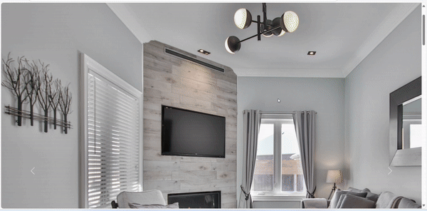

# Emaartech Bina Projesi

Bu proje, modern bir bina tasarımını Bootstrap kütüphanesi ile oluşturmaktadır. Kullanıcı dostu bir arayüz ve şık bir görünüm sağlamak için HTML ve CSS kullanılmıştır.

## Proje Özellikleri

-Responsive Tasarım Farklı ekran boyutlarına uyum sağlar.
-Bootstrap Kullanımı:\*\* Hızlı ve kolay bir tasarım süreci için Bootstrap kütüphanesi kullanıldı.

- Kullanıcı Dostu Arayüz:\*\* Kolay gezilebilir ve kullanıcı dostu bir tasarım.

## Ekran Görüntüsü

